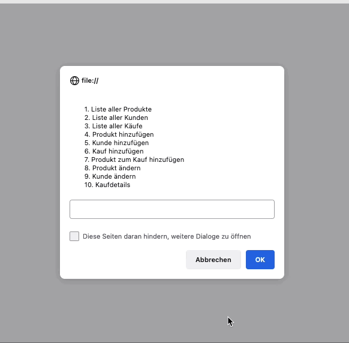

# JavaScript

!!! note

    You have time until 23:59 on 6th November 2022
    Please send your result as an `index.html` to `michael.bykovski@hs-rm.de`.

Create a Web Shop with JavaScript Fundamentals.
Use functions, classes, arrays, objects, alert, prompt and so on.



## Menu

The interface consists only of prompts and alerts. No console.logs!

The menu is:

```
1. Liste aller Produkte
2. Liste aller Kunden
3. Liste aller Käufe
4. Produkt hinzufügen
5. Kunde hinzufügen
6. Kauf hinzufügen
7. Produkt zum Kauf hinzufügen
8. Produkt ändern
9. Kunde ändern
10. Kaufdetails
```

---

### `1. Liste aller Produkte`

lists all created products in the form: `#id name formattedPrice EUR`.

As example:

```
#1 iPhone 14 1399.99 EUR
```

---

### `2. Liste aller Kunden`

lists all created customers in the form: `#id firstName lastName`.

As example:

```
#1 Michael Tester
```

---

### `3. Liste aller Käufe`

lists all created orders in the form: `#id createdDate formattedPrice EUR firstName lastName`.

As example:

```
#1 - 15.10.2022 13:17:53 369 EUR Michael Tester
```

---

### `4. Produkt hinzufügen`

creates a new product.

First the programm should ask for the product name.
Then the programm asks for the price in cents.
The price must be an integer, float values are not allowed!
After the price was set the new product with a new product id was created.

If the user clicks on "Cancel" or "Abbrechen", you redirect to the menu again.

---

### `5. Kunde hinzufügen`

creates a new customer.

First the programm should ask for the first name, then the last name.
After the last namewas set the new customer with a new customer id was created.

If the user clicks on "Cancel" or "Abbrechen", you redirect to the menu again.

---

### `6. Kauf hinzufügen`

creates a new order.

First the programm asks for a customer id.
If the customer could not be found, the programm prints a hint and asks again for the customer id.
After the customer was selected the order with a new order id is created.

If the user clicks on "Cancel" or "Abbrechen", you redirect to the menu again.

---

### `7. Produkt zum Kauf hinzufügen`

adds a product with a specific amount to the order.

First the programm asks for an order id.
If the order could not be found, the programm prints a hint and asks again for the order id.
Then the programm asks for a customer id.
If the product could not be found, the programm prints a hint and asks again for the customer id.
Then the amount is asked. Only integers are allowed.
After the amount was entered, the product is added with the specific amount to the order.

If the user clicks on "Cancel" or "Abbrechen", you redirect to the menu again.

---

### `8. Produkt ändern`

changes a product.

The programm first asks for the product id.
If the product could not be found, the programm prints a hint and asks again for the product id.
When the product was found, it prompts the current product name, so it can be changed.
When the product name was set it prompts the current price, so it can be changed (again only integers!).
After everything was set, the product gets saved.

!!! warning

    **If products change, products in orders SHOULD NOT be changed too!**

    So for example the price of products in order should not be changed!

If the user clicks on "Cancel" or "Abbrechen", you redirect to the menu again.

---

### `9. Kunde ändern`

changes a customer.

The programm first asks for the customer id.
If the customer could not be found, the programm prints a hint and asks again for the customer id.
When the customer was found, it prompts the current customer first name, so it can be changed.
Then it prompts the current customer last name, so it can be changed.
After everything was set, the customer gets saved.

!!! warning

    **If customers change, customers in orders SHOULD NOT be changed too!**

    So for example the first name of the customer in an order should not be changed!

If the user clicks on "Cancel" or "Abbrechen", you redirect to the menu again.

---

### `10. Kaufdetails`

prints a detailed version of an order.

The programm first asks for the order id.
If the order could not be found, the programm prints a hint and asks again for the order id.
When the order was found, it prints the following order information.

The format is:

```
Kunde: #1 - Michael Bykovski

Produkte:

- 3x #1 - Test (1.23 EUR) = 3.69 EUR
- 4x #2 - Noch ein Test (3.21 EUR) = 12.84 EUR

-------------------

Bestellt am: 17.10.2022 16:59:38
Summe: 16.53 EUR
```

If the user clicks on "Cancel" or "Abbrechen", you redirect to the menu again.

## Customers

Customers have only the fields: first name and last name.

## Products

Products have the field name and price.

The price is saved in cents. So if the price is: `100` that's `100 Cents` which are `1 EUR`.

## Orders

Orders save the current customer, BUT they make a **copy** of the customer, because the customer can change and we want to store the customer values to the moment, where the customer bought the products.
Also products are **copied**, because the price of a product can change afterwards.
