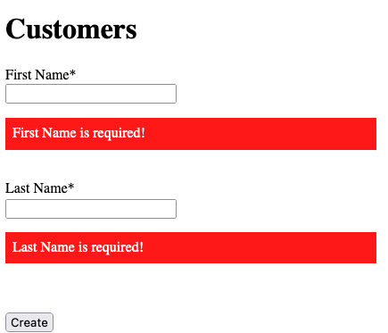
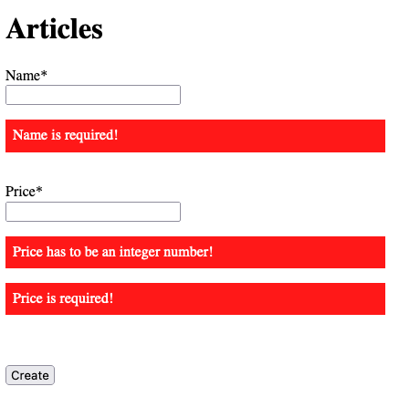
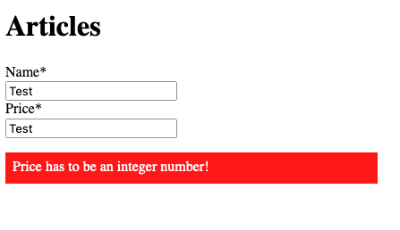
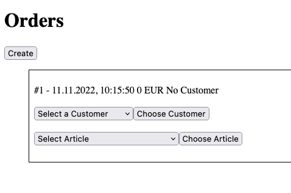
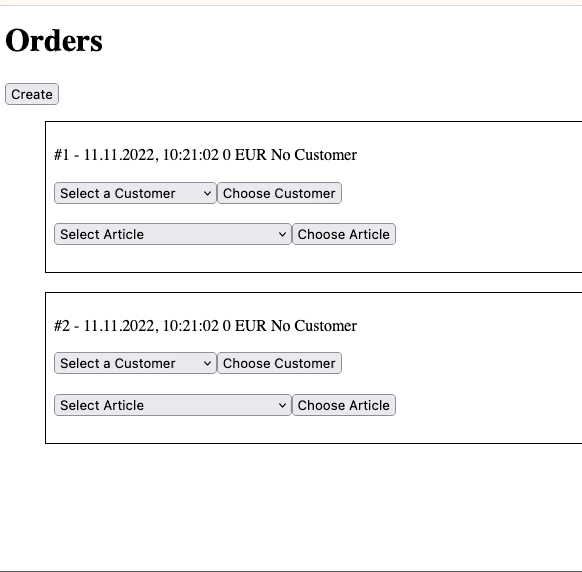

# Web UI

[Demo](./demo/index.html)

!!! note

    You have time until 23:59 on 20th November 2022.

    Please send your result as an index.html (optionally index.js) to michael.bykovski@hs-rm.de.

Create a webshop with Web UI.
Use the web api of the browser to create, remove and change elements in the browser.

Hint: Use stores that represent your data in a class and update after you change those stores.
Hint2: You are allowed to build a "rendering" logic like React.

You are allowed to create HTML elements, before the script starts, **but** all updating elements should be created by JavaScript.
Your are **not** allowed to "precreate" elements in HTML and copy those elements.
You are **not** allowed to use "innerHTML".

You are **not** allowed to use any libraries or frameworks. The code should be vanilla JavaScript.

# Task

Create a Webshop, where you can create Customers, Articles and Orders.

# Customers

You have to check for the input that was entered.
First Name and Last Name are required and should be prompted if the user has not input the data:

# Articles

You have to check for the input that was entered.
Name and Price are required and should be prompted if the user has not input the data:
Price should be an integer value and should be prompted if the user has not input it correctly.

---

# Order

First the user is able to create as many orders as he/she wants.

After that the user is able to select a customer or articles from a dropdown.
The user has to confirm his/her selection with a button.

If a new article gets created or a new customer gets created, the dropdown should refresh accordingly with the new values.

It doesn't matter if a customer or an article gets added.
The UI should display always the current state of the order as text in the head of the box.

A customer can be choosed only once.

An article can be added multiple times. There is also the possibility to remove an article.
If there is no amount from an article anymore, the article should be removed from the list.
