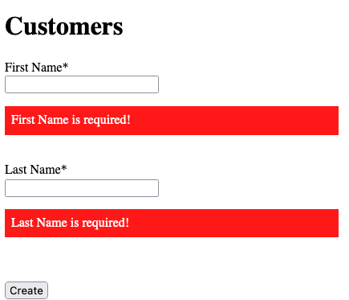
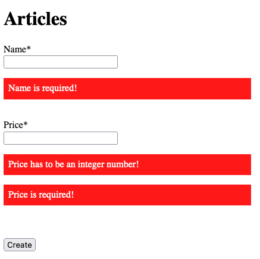
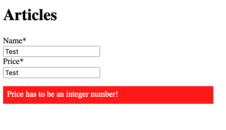
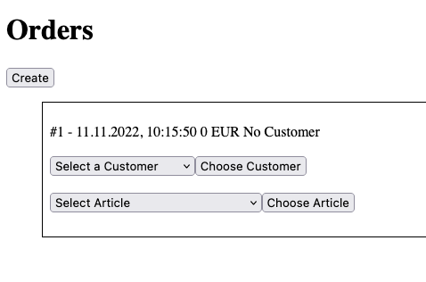
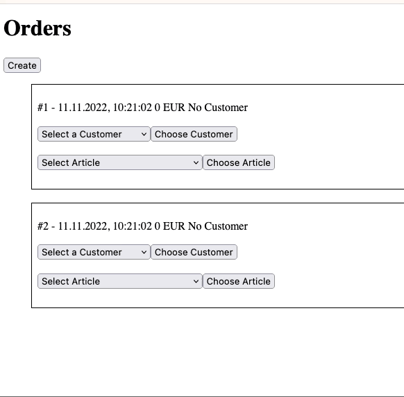

# React

[Demo](./demo/index.html)

Create a webshop with Web UI.
Use the web api of the browser to create, remove and change elements in the browser.

# Task

Create a Webshop in React, where you can create Customers, Articles and Orders.
User React Context, State and Props to fulfill the requirements.

# Customers

You have to check for the input that was entered.
First Name and Last Name are required and should be prompted if the user has not input the data:

# Articles

You have to check for the input that was entered.
Name and Price are required and should be prompted if the user has not input the data:
Price should be an integer value and should be prompted if the user has not input it correctly.

---

# Order

First the user is able to create as many orders as he/she wants.

After that the user is able to select a customer or articles from a dropdown.
The user has to confirm his/her selection with a button.

If a new article gets created or a new customer gets created, the dropdown should refresh accordingly with the new values.

It doesn't matter if a customer or an article gets added.
The UI should display always the current state of the order as text in the head of the box.

A customer can be choosed only once.

An article can be added multiple times. There is also the possibility to remove an article.
If there is no amount from an article anymore, the article should be removed from the list.
