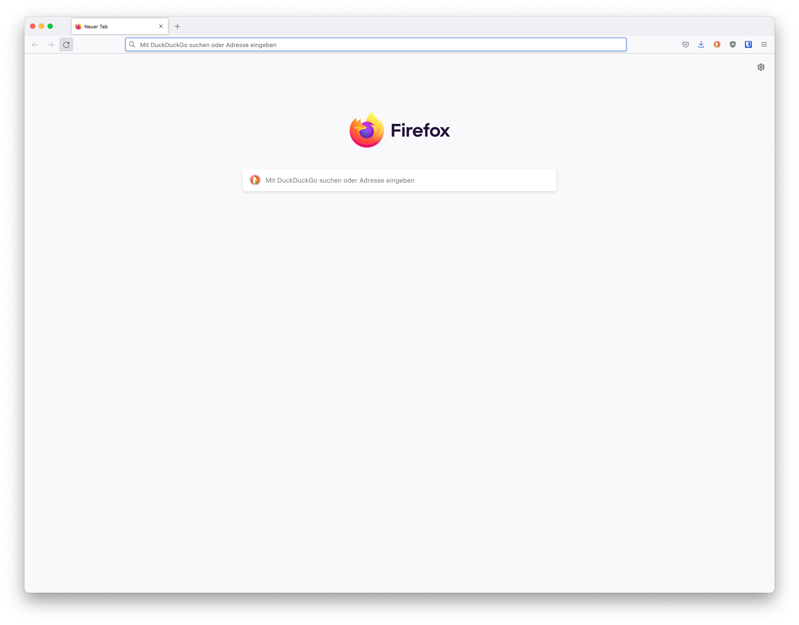
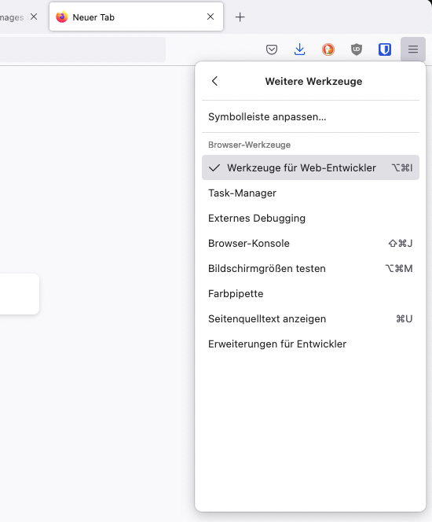

# Setup

I believe you have the motivation and a strong desire to be a developer, a computer and Internet. If you have those, then you have everything to get started.

## Install Node.js

You may not need Node.js right now but you may need it for later. Install [node.js](https://nodejs.org/en/).


After downloading double click and install


We can check if node is installed on our local machine by opening our device terminal or command prompt.

```sh
asabeneh $ node -v
v12.14.0
```

When making this tutorial I was using Node version 12.14.0, but now the recommended version of Node.js for download is v14.17.6, by the time you use this material you may have a higher Node.js version.

## Browsers and Engines

There are many browsers out there. However, I strongly recommend Firefox.

Following engines are used by the browsers:

- V8 from Google is the most used JavaScript engine. Google Chrome and the many other Chromium-based browsers use it, as do applications built with CEF, Electron, or any other framework that embeds Chromium. Other uses include the Node.js and Deno runtime systems.
- SpiderMonkey is developed by Mozilla for use in Firefox and its forks. The GNOME Shell uses it for extension support.
- JavaScriptCore is Apple's engine for its Safari browser. Other WebKit-based browsers also use it. KJS from KDE was the starting point for its development.[7]
- Chakra is the engine of the Internet Explorer browser. It was also forked by Microsoft for the original Edge browser, but Edge was later rebuilt as a Chromium-based browser and thus now uses V8.[8][9]

### Installing Firefox

Install [Firefox](https://www.mozilla.org/de/firefox/new/) if you do not have one yet. We can write small JavaScript code on the browser console, but we do not use the browser console to develop applications.



### Opening Developer Tools

You can open Developer Tools either by clicking three dots at the top right corner of the browser, selecting _More tools -> Developer tools_ or using a keyboard shortcut. I prefer using shortcuts.



To open the Firefox Developer Tools using a keyboard shortcut.

```sh
Mac
Command+Option+I

Windows/Linux:
Ctl+Shift+I
```

After you open the Firefox Developer Tools, try to explore the marked buttons. We will spend most of the time on the Console. The Console is the place where your JavaScript code goes. The Spidermonkey engine changes your JavaScript code to machine code.

#### Console.log

To write our first JavaScript code, we used a built-in function **console.log()**. We passed an argument as input data, and the function displays the output. We passed `'Hello, World'` as input data or argument in the console.log() function.

```js
console.log("Hello, World!");
```

#### Console.log with Multiple Arguments

The **`console.log()`** function can take multiple parameters separated by commas. The syntax looks like as follows:**`console.log(param1, param2, param3)`**

```js
console.log("Hello", "World", "!");
console.log("HAPPY", "NEW", "YEAR", 2020);
console.log("Welcome", "to", 30, "Days", "Of", "JavaScript");
```

As you can see from the snippet code above, _`console.log()`_ can take multiple arguments.

Congratulations! You wrote your first JavaScript code using _`console.log()`_.
