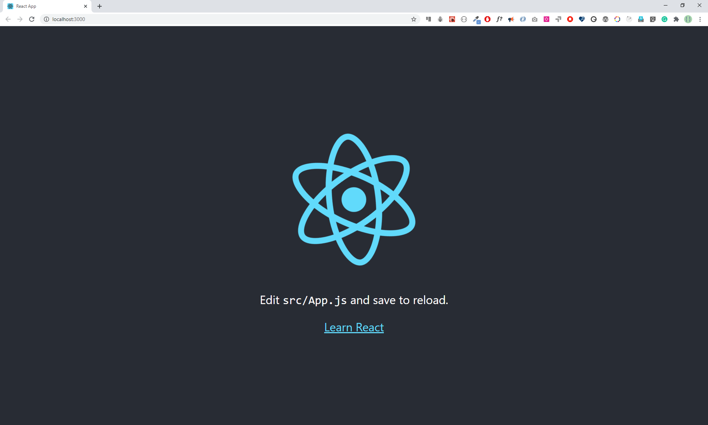

# Setting Up

In the previous section, we learned about JSX and we accessed the React and ReactDOM package using CDN. However, in real projects instead of CDN you will use the create-react-app package to generate a React project starter(boilerplate). The initial _create-react-app_ was released on Jul 22, 2016. Before this time, developers used to configure webpack with a JavaScript module bundler, babel and all the necessary packages manually and this used to take half an hour or maybe more. Now, create-react-app will take care of everything and you will be in charge of only developing the product, instead of spending too much time configuring and setting up projects. Before we start using different tools, let's have a brief introduction to all the tools we are going to use in this challenge. You do not have to understand everything, but I will try to give a very short introduction to some of the tools and technologies that we use when we work with React.

## Create React App

To create a react project you can use one of the following ways. Let's assume you installed node. Open the command line interface (CLI), git bash or terminal on Mac or Linux. Then run the following command. I am using git bash.

```sh
$ npx create-react-app name-of-your-project
```

If you do not like to write npx every time you create a project you may install create-react-app package globally in your computer using the following command.

```sh
$ npm install -g create-react-app
```

After you installed create-react-app, you create a React application as follows:

```sh
$ create-react-app name-of-project
```

# Your first React App

```sh
$ cd Desktop/
```

```sh
$ npx create-react-app react-app
```

```sh
$ cd react-app
```

```sh
$ yarn start
```

Now your React app should run at localhost 3000. Go to the App.js and modify the content by writing some text, you will see the latest changes on the browser.
To stop the server, press Ctr + C in the CLI.



## React Boilerplate

Let's see the React boilerplate, which has been created by create-react-app. Whenever you create a new project, you run create-react-app and name of the project.

In the following React boilerplate, there are three folders: node_modules, public and src. In addition, there are .gitignore, README.md, package.json and yarn.lock. Some of you, instead of yarn.lock, you may have package-lock.json.

It is good to know these folders and files.

- node_modules - stores all the necessary node packages of the React applications.

- /public

  - index.html - the only HTML file we have in the entire application
  - favicon.ico - an icon file
  - manifest.json - is used to make the application a progressive web app
  - other images - open graph images(open graph images are images which are visible when a link share on social media)
  - robots.txt - information, if the website allows web scraping

- /src

  - App.css, index.css - are different CSS files
  - index.js - a file which allows to connect all the components with index.html
  - App.js - A file where we usually import most of the presentational components
  - App.test.js - Tests with testing library and jest
  - reportWebVitals.js: is useful to collect Web Vitals information
  - setupTests.js - to write testing cases
  - logo.svg - just a svg file

- package.json - List of packages the applications uses
- .gitignore - React boilerplate comes with git initiated, and the .gitingore allows files and folders not to be pushed to GitHub
- README.md - Markdown file to write documentation
- yarn.lock or package-lock.json - a means to lock the version of the package

```js title="index.js"
import React from "react";
import ReactDOM from "react-dom/client";
import "./index.css";
import App from "./App";
import reportWebVitals from "./reportWebVitals";

const root = ReactDOM.createRoot(document.getElementById("root"));
root.render(
  <React.StrictMode>
    <App />
  </React.StrictMode>
);

// If you want to start measuring performance in your app, pass a function
// to log results (for example: reportWebVitals(console.log))
// or send to an analytics endpoint. Learn more: https://bit.ly/CRA-vitals
reportWebVitals();
```

```html title="index.html"
<!DOCTYPE html>
<html lang="en">
  <head>
    <meta charset="utf-8" />
    <link rel="icon" href="%PUBLIC_URL%/favicon.ico" />
    <meta name="viewport" content="width=device-width, initial-scale=1" />
    <meta name="theme-color" content="#000000" />
    <meta
      name="description"
      content="Web site created using create-react-app"
    />
    <link rel="apple-touch-icon" href="%PUBLIC_URL%/logo192.png" />
    <!--
      manifest.json provides metadata used when your web app is installed on a
      user's mobile device or desktop. See https://developers.google.com/web/fundamentals/web-app-manifest/
    -->
    <link rel="manifest" href="%PUBLIC_URL%/manifest.json" />
    <!--
      Notice the use of %PUBLIC_URL% in the tags above.
      It will be replaced with the URL of the `public` folder during the build.
      Only files inside the `public` folder can be referenced from the HTML.

      Unlike "/favicon.ico" or "favicon.ico", "%PUBLIC_URL%/favicon.ico" will
      work correctly both with client-side routing and a non-root public URL.
      Learn how to configure a non-root public URL by running `npm run build`.
    -->
    <title>React App</title>
  </head>
  <body>
    <noscript>You need to enable JavaScript to run this app.</noscript>
    <div id="root"></div>
    <!--
      This HTML file is a template.
      If you open it directly in the browser, you will see an empty page.

      You can add webfonts, meta tags, or analytics to this file.
      The build step will place the bundled scripts into the <body> tag.

      To begin the development, run `npm start` or `yarn start`.
      To create a production bundle, use `npm run build` or `yarn build`.
    -->
  </body>
</html>
```

## Injecting data to JSX elements

```js title="index.js"
import React from "react";
import ReactDOM from "react-dom/client";

const welcome = "Welcome to Webengineering";
const title = "Getting Started React";
const subtitle = "JavaScript Library";
const author = {
  firstName: "Michael",
  lastName: "Bykovski",
};
const date = "18. August 2022";

// JSX element, header
const header = (
  <header>
    <div>
      <h1>{welcome}</h1>
      <h2>{title}</h2>
      <h3>{subtitle}</h3>
      <p>
        Instructor: {author.firstName} {author.lastName}
      </p>
      <small>Date: {date}</small>
    </div>
  </header>
);

const numOne = 3;
const numTwo = 2;

const result = (
  <p>
    {numOne} + {numTwo} = {numOne + numTwo}
  </p>
);

const yearBorn = 1994;
const currentYear = new Date().getFullYear();
const age = currentYear - yearBorn;
const personAge = (
  <p>
    {author.firstName} {author.lastName} is {age} years old
  </p>
);

// JSX element, main
const techs = ["HTML", "CSS", "JavaScript"];
const techsFormatted = techs.map((tech) => <li>{tech}</li>);

// JSX element, main
const main = (
  <main>
    <div>
      <p>
        Prerequisite to get started{" "}
        <strong>
          <em>react.js</em>
        </strong>
        :
      </p>
      <ul>{techsFormatted}</ul>
      {result}
      {personAge}
    </div>
  </main>
);

const copyRight = "Copyright 2022";

// JSX element, footer
const footer = (
  <footer>
    <div>
      <p>{copyRight}</p>
    </div>
  </footer>
);

// JSX element, app
const app = (
  <div>
    {header}
    {main}
    {footer}
  </div>
);

const root = ReactDOM.createRoot(document.getElementById("root"));
root.render(<React.StrictMode>{app}</React.StrictMode>);
```


## Importing Media Objects in React

How do we import images, video and audio in React? Let's see how we import images first.
Create images folder in the src folder and save an image inside. For instance let's save react.jpg image and let's import this image to index.js. After importing we will inject it to a JSX expression, user. See the code below.

```js
// index.js
import React from "react";
import ReactDOM from "react-dom";
import reactJPG from "./images/react.jpg";

const app = (
  <div>
    
  </div>
);

const root = ReactDOM.createRoot(document.getElementById("root"));
root.render(<React.StrictMode>{app}</React.StrictMode>);
```


See more possibilities in the documentation of [create-react-app](https://create-react-app.dev/docs/getting-started)
